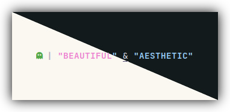
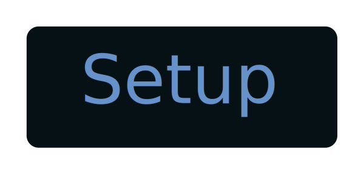
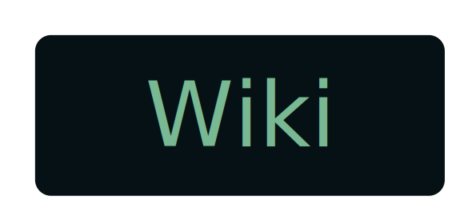
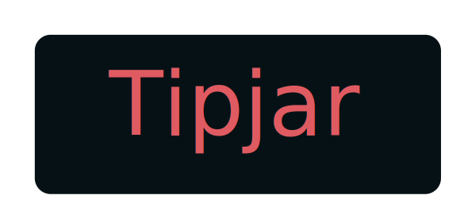
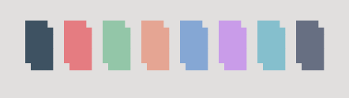
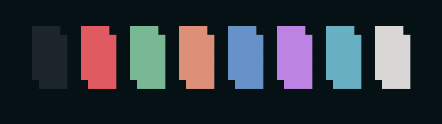
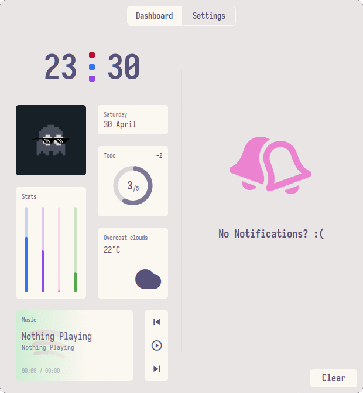
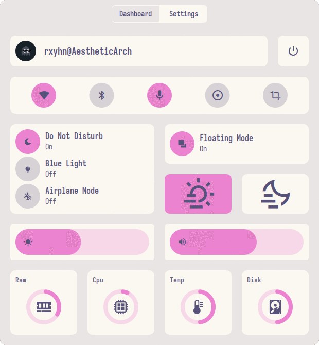
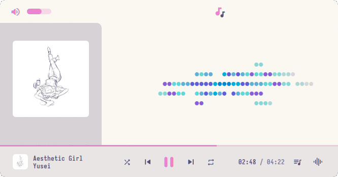

<!-- DOTFILES BANNER -->
<div align="center">
    
</div>

<p align="center">
  <b>🌕 Beautiful & Aesthetic Dotfiles 🌑</b>
</p>

<p align="center">
<a href="#wrench--setup"></a>
<a href="https://github.com/rxyhn/dotfiles/wiki"></a>
<a href="#ocean--gallery"></a>
<a href="#money_with_wings--tip-jar"></a>
</p>

<br>

<!-- RICE PREVIEW -->
<div align="center">
    
</div>

<br>

## Hi there! Thanks for dropping by! 🖤
<a href="https://awesomewm.org/"></a>

<b>  Beautiful & Aesthetic AwesomeWM Configuration Files!  </b>

Welcome to my AwesomeWM configuration files!

This is my personal collection of configuration files.

You might be here for looking my AwesomeWM configuration files? or looking for **Linux Rice** reference?

feel free to steal anything from here but don't forget to give me **credits** :)

AwesomeWM is the most powerful and highly configurable, next generation framework window manager for X, 
Although it takes time and effort to configure it, but I'm very satisfied with the result.

This is a beautiful user interface isn't it?

These dotfiles are made with love, for sure.

<!-- INFORMATION -->
## :snowflake: ‎ <samp>Information</samp> 



Here are some details about my setup:

- **OS:** [Arch Linux](https://archlinux.org)
- **WM:** [awesome](https://github.com/awesomeWM/awesome)
- **Terminal:** [alacritty](https://github.com/alacritty/alacritty)
- **Shell:** [zsh](https://www.zsh.org/)
- **Editor:** [neovim](https://github.com/neovim/neovim) / [vscode](https://github.com/microsoft/vscode)
- **Compositor:** [picom](https://github.com/yshui/picom)
- **Application Launcher:** [rofi](https://github.com/davatorium/rofi)
- **Music Player** [ncmpcpp](https://github.com/ncmpcpp/ncmpcpp)

AwesomeWM Modules:

- **[bling](https://github.com/blingcorp/bling)**
   + Adds new layouts, modules, and widgets that try to primarily focus on window management
- **[rubato](https://github.com/andOrlando/rubato)**
   + Creates smooth animations with a slope curve for awesomeWM (Awestore, but not really)
- **[layout-machi](https://github.com/xinhaoyuan/layout-machi)**
   + Manual layout for Awesome with an interactive editor

<br>

> This repo has a wiki! You can check it by clicking ~~[here](https://www.youtube.com/watch?v=UIp6_0kct_U)~~ [here](https://github.com/rxyhn/dotfiles/wiki).

<!-- SETUP -->
## :wrench: ‎ <samp>Setup</samp>

<table align="right">
  <tr>
    <th align="center">
      <sup><sub>⚠ WARNING ⚠</sub></sup>
    </th>
  </tr>
  <tr>
    <td align="center">
      <sup>
         <sub>
            <samp>
                  THIS DOTFILES ARE CONFIGURED AT 1366x768 WITH 96 DPI
               <p align="center">
                  BUT IT WILL STILL WORK PERFECTLY IN HIGH RESOLUTION
               </p>
                  DONT WORRY JUST INSTALL THESE DOTFILES AND GIVE THIS REPO A STARS
            </samp>
         </sub>
      </sup>
    </td>
  </tr>
</table>

>This is step-by-step how to install these dotfiles. Just [R.T.F.M](https://en.wikipedia.org/wiki/RTFM).

<details>
<summary><b>Install Required Dependencies</b></summary>

> First of all you should install the [git version of AwesomeWM](https://github.com/awesomeWM/awesome/).

**Arch users** can use the [awesome-git AUR package](https://aur.archlinux.org/packages/awesome-git/).
   ```sh
   paru -S awesome-git
   ```

**For other distros**, build instructions are [here](https://github.com/awesomeWM/awesome/#building-and-installation).

> Install necessary dependencies

**Arch Linux (and other Arch-based distributions)**

   Assuming your **AUR Helper** is [paru](https://github.com/Morganamilo/paru).

   ```sh
   paru -Sy picom-git alacritty rofi todo-bin papirus-icon-theme acpi acpid acpi_call \
   upower iw iproute2 wireless_tools jq inotify-tools polkit-gnome xdotool xclip \
   brightnessctl alsa-utils alsa-tools pulseaudio pulseaudio-alsa scrot redshift \
   feh mpv mpd mpc mpdris2 ncmpcpp playerctl ffmpeg bluez-utils gpick --needed 
   ```

</details>

<details>
<summary><b>Install Needed Fonts</b></summary>

> You will need to install a few fonts (mainly icon fonts) in order for text and icons to be rendered properly.

Necessary fonts:
   + **Iosevka**              - [here](https://github.com/be5invis/Iosevka)
   + **Icomoon**              - [here](https://www.dropbox.com/s/hrkub2yo9iapljz/icomoon.zip?dl=0)
   + **Material Icons**       - [here](https://github.com/google/material-design-icons)
   + **FiraCode Nerd Font**   - [here](https://github.com/ryanoasis/nerd-fonts)

Also you can find the required icon fonts inside the `misc/fonts` folder of this repository.

Once you download them and unpack them, place them into `~/.fonts` or `~/.local/share/fonts`

And run this command for your system to detect the newly installed fonts.

   ```sh
   fc-cache -v
   ```

</details>

<details>
<summary><b>Install my AwesomeWM configuration files</b></summary>

> Clone this repository

   ```sh
   git clone https://github.com/rxyhn/dotfiles.git
   cd dotfiles
   ```

> Copy config and binaries files

   ```sh
   cp -r config/* ~/.config/
   cp -r bin/* ~/.local/bin/
   ```

> Finally, now you can login with AwesomeWM

   Congratulations, at this point you have installed this aesthetic dotfiles! :tada:

   Log out from your current desktop session and log in into AwesomeWM

</details>

<!-- GALLERY -->
## :ocean: ‎ <samp>Gallery</samp>

<b>These are the features included in my AwesomeWM setups!</b>

   + Minimalist `wibar` design
      - <details>
         <summary>Preview</summary>

         *Simple, Minimalist and Modern Bar Design!*

         - App launcher
         - Web search
         - Taglist
         - Battery indicator
         - Clock
         - Layoutbox

         <div align="left">
         
         </div>
         </details>
   + Aesthetic `Dashboard` ngl.
      - <details>
         <summary>Preview</summary>

         *Aesthetic dashboard with neat grid layout, it's so beautiful!*

         - Time & date
         - Pfp display
         - ToDo reminder
         - Hardware stats
         - Weather widget
         - Music player
         - Notifs center

         <div align="left">
         
         </div>
         </details>
   + Very useful `Control Center` ikr.
      - <details>

          *This control center has many features!*

         - Exit screen
         - Volume & brightness control
         - DnD, Blue light & Airplane mode
         - Floating layout mode
         - Theme switcher
         - Wifi, Bluetooth and Microphone toggle
         - built in screenrec and screensht widgets
         - Hardware Monitor

         <summary>Preview</summary>
         <div align="left">
         
         </div>
         </details>
   + Custom mouse-friendly `ncmpcpp` UI with album art ofc.
      - <details>
         <summary>Preview</summary>

         *This is so aesthetic isn't it?*

         <div align="left">
         
         </div>
         </details>
   + `Word Clock Lockscreen` with PAM Integration!
      - <details>

         *A beautiful word clock is on the lockscreen!*

         <summary>Preview</summary>
         <div align="left">
         
         </div>
         </details>

<!-- MISCELLANEOUS -->
## :four_leaf_clover: ‎ <samp>Miscellaneous</samp>

<details>
<summary><b>Configure stuff</b></summary>

> The relevant files are inside your `~/.config/awesome` directory.

+ User preferences and default applications

   In `rc.lua` there is a *Default Applications* section where user preferences and default applications are defined.
   You should change those to your liking.

Note: For the weather widgets to work, you will also need to create an account on [openweathermap](https://openweathermap.org), get your key, look for your city ID, and set `openweathermap_key` and `openweathermap_city_id` accordingly.

</details>

<details>
<summary><b>Keybinds</b></summary>

I use <kbd>super</kbd> AKA Windows key as my main modifier.
also with <kbd>alt, shift, and ctrl</kbd>

**Keyboard**

| Keybind                                 | Action                                                    |
|-----------------------------------------|-----------------------------------------------------------|
| <kbd>super + enter</kbd>                | Spawn terminal                                            |
| <kbd>super + grave</kbd>                | Spawn music client                                        |
| <kbd>super + d</kbd>                    | Spawn application launcher                                |
| <kbd>super + shift + w</kbd>            | Spawn web browser                                         |
| <kbd>super + shift + x</kbd>            | Spawn color picker                                        |
| <kbd>super + shift + f</kbd>            | Spawn file manager                                        |
| <kbd>super + shift + d</kbd>            | Toggle central panel                                      |
| <kbd>super + shift + t</kbd>            | Toggle system tray                                        |
| <kbd>super + q</kbd>                    | Close client                                              |
| <kbd>super + x</kbd>                    | Exit screen                                               |
| <kbd>super + ctrl + l</kbd>             | Lock screen                                               |
| <kbd>super + [1-0]</kbd>                | View tag AKA change workspace (for you i3/bsp folks)      |
| <kbd>super + shift + [1-0]</kbd>        | Move focused client to tag                                |
| <kbd>super + space</kbd>                | Select next layout                                        |
| <kbd>super + s</kbd>                    | Set tiling layout                                         |
| <kbd>super + shift + s</kbd>            | Set floating layout                                       |
| <kbd>super + c</kbd>                    | Center floating client                                    |
| <kbd>super + [arrow keys]</kbd>         | Change focus by direction                                 |
| <kbd>super + f</kbd>                    | Toggle fullscreen                                         |
| <kbd>super + m</kbd>                    | Toggle maximize                                           |
| <kbd>super + n</kbd>                    | Minimize                                                  |
| <kbd>ctrl + super + n</kbd>             | Restore minimized                                         |
| <kbd>alt + tab</kbd>                    | Window switcher                                           |

<br>

**Mouse on the desktop**

| Mousebind          | Action                                     |
|--------------------|--------------------------------------------|
| `left click`       | Dismiss all notifications                  |
| `right click`      | Main menu                                  |
| `middle click`     | Toggle central panel                       |
| `scroll up/down`   | Cycle through tags                         |

*For more information check `awesome/configuration/keys.lua`*

</details>

<details>
<summary><b>VSCode</b></summary>

<div align="left">
    
</div>

### :milky_way: ‎ <samp>Aesthetic VSCode</samp>

Setup:

1. Install required extension
    - [Customize UI](https://marketplace.visualstudio.com/items?itemName=iocave.customize-ui)
    - [Carbon Product Icons](https://marketplace.visualstudio.com/items?itemName=antfu.icons-carbon)

    note: You can use any themes, but some of the colors will be overwritten by mine
2. copy config file
    ```sh
    cp misc/vscode/User/settings.json ~/.config/Code/User

    ```

</details>

<!-- HISTORY -->
## :japan: ‎ <samp>History</samp>

This started since when im feel bored, idk why i do this things, i love it but ahhh nvm, 
but basically im doing this just for fun and also to satisfy myself ofc,
and also look for a lot of [stargazers](https://github.com/rxyhn/dotfiles/stargazers) for sure.
so if you `like` or are `using` these dotfiles you should give this **repo** a `star` right now!
so i'll be more enthusiastic to make other beautiful and aesthetics things!

Thank you! <3

[](https://starchart.cc/rxyhn/dotfiles)

<!-- TIP JAR -->
## :money_with_wings: ‎ <samp>TIP JAR</samp>

If you enjoyed it and would like to show your appreciation, you may want to tip me here.

It is never required but always appreciated.

Thanks from the bottom of my heart! ‎ :heartpulse:

[](https://ko-fi.com/rxyhn)

<!-- ACKNOWLEDGEMENTS -->
## :bulb: ‎ <samp>Acknowledgements</samp>

- **Special thanks to**

   + *Contributors*
      - [`rxyhn`](https://github.com/rxyhn) *there's nothing wrong with thanking yourself right?*
      - [`ner0z`](https://github.com/ner0z)
      - [`paulhersch`](https://github.com/paulhersch)
      - [`ChocolateBread799`](https://github.com/ChocolateBread799)
      - [`janleigh`](https://github.com/janleigh)
      - [`rototrash`](https://github.com/rototrash)

   + *And for them, ofc.*
      - [`elenapan`](https://github.com/elenapan)
      - [`manilarome`](https://github.com/manilarome)
      - [`JavaCafe01`](https://github.com/JavaCafe01)

<br>

<p align="center"></p>
<p align="center"><a href="https://github.com/rxyhn/AwesomeWM-Dotfiles/blob/main/.github/LICENSE"></a></p>
