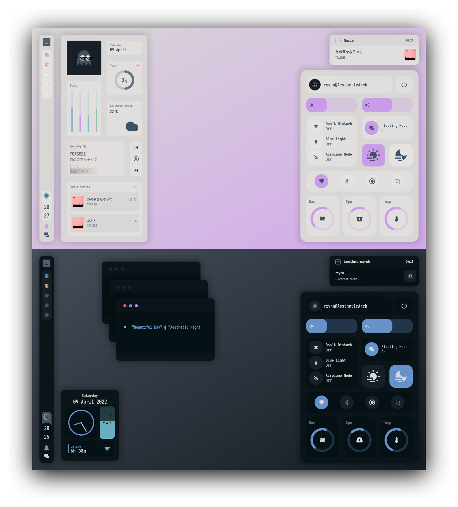
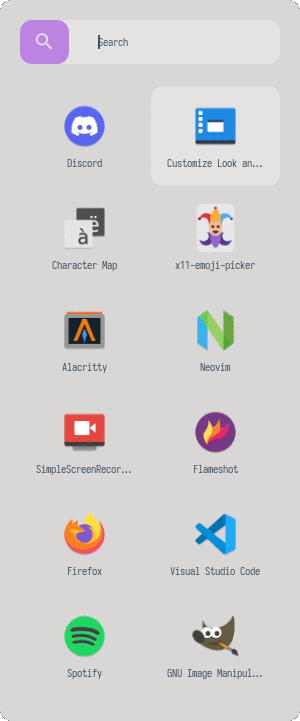

<!-- Screenshot -->
<div align="center">
    
</div>

<h2></h2><br>

<p align="center">
  <b>🌕 Rxyhn's Beautiful & Aesthetic Configuration Files 🌑</b>
</p>


<h2></h2><br>

<div align="center">
    
</div>

<br>
<br>

### Hi there! Thanks for dropping by! 🖤
<a href="https://awesomewm.org/"></a>

<b>  Beautiful & Aesthetic AwesomeWM Dotfiles! ✨  </b>

Welcome to my AwesomeWM configuration files! 
You might be here for looking my AwesomeWM configuration files? or looking for **Linux Rice** reference?
feel free to steal anything from here but don't forget to give me **credits** :)

AwesomeWM is the most powerful and highly configurable, next generation framework window manager for X, 
Although it takes time and effort to configure it, but I'm very satisfied with the result.
This is a beautiful user interface isn't it?

These dotfiles are made with love, for sure.

<h2></h2><br>

**Here are some details about my setup:**

| Programs   | Using             |
| ---------- | ----------------- |
| WM         | awesome           |
| OS         | arch linux        |
| Terminal   | alacritty         |
| Shell      | zsh               |
| Editor     | neovim / vscode   |
| Compositor | picom             |
| Launcher   | rofi              |

<h2></h2><br>

<table align="right">
  <tr>
    <th align="center">
      <sup><sub>⚠ WARNING ⚠</sub></sup>
    </th>
  </tr>
  <tr>
    <td align="center">
      <sup>
         <sub>
            <samp>
                  THIS DOTFILES ARE CONFIGURED AT 1366x768 WITH 96 DPI
               <p align="center">
                  BUT IT WILL STILL WORK PERFECTLY IN HIGH RESOLUTION
               </p>
                  DONT WORRY JUST INSTALL THESE DOTFILES AND GIVE THIS REPO A STARS
            </samp>
         </sub>
      </sup>
    </td>
  </tr>
</table>

<details>
<summary><strong>S E T U P</strong></summary>

   > This is step-by-step how to install these dotfiles. Just [R.T.F.M](https://en.wikipedia.org/wiki/RTFM).

   > This setup only provided for **Arch Linux** (and all Arch-based distributions)

   1. Install the [git version of AwesomeWM](https://github.com/awesomeWM/awesome/).

      ```sh
      paru -S awesome-git
      ```

   2. Install dependencies and enable services

      + Dependencies

         ```sh
         paru -Sy picom-git alacritty rofi todo-bin acpi acpid acpi_call \
         wireless_tools jq inotify-tools polkit-gnome xdotool xclip maim \
         brightnessctl alsa-utils alsa-tools pulseaudio pulseaudio-alsa gpick \
         redshift mpd mpc mpdris2 ncmpcpp playerctl ffmpeg bluez-utils --needed 
         ```

      + Services

         ```sh
         # For automatically launching mpd on login
         systemctl --user enable mpd.service
         systemctl --user start mpd.service

         # For charger plug/unplug events (if you have a battery)
         sudo systemctl enable acpid.service
         sudo systemctl start acpid.service
         ```

   3. Install needed fonts

      You will need to install a few fonts (mainly icon fonts) in order for text and icons to be rendered properly.

      Necessary fonts:
      + **Iosevka**  - [here](https://github.com/ryanoasis/nerd-fonts/)
      + **Icomoon**  - [here](https://www.dropbox.com/s/hrkub2yo9iapljz/icomoon.zip?dl=0)
      + **Material Design** - [here](https://github.com/Templarian/MaterialDesign-Font)

      Once you download them and unpack them, place them into `~/.fonts` or `~/.local/share/fonts`
      and run this command for your system to detect the newly installed fonts.

      ```sh
      fc-cache -v
      ```
   
   4. Install my AwesomeWM configuration files

      > Clone this repository

      ```sh
      git clone https://github.com/rxyhn/dotfiles.git
      cd dotfiles
      ```

      > Copy config and binaries files

      ```sh
      cp -r config/* ~/.config/
      cp -r bin/* ~/.local/bin/
      cp -r misc/. ~/
      ```

      > You have to add `TODO_PATH` in your env variable

      ```sh
      export TODO_PATH="path/to/todo"
      ```

   5. Configure stuff

      The relevant files are inside your `~/.config/awesome` directory.

      + User preferences and default applications

         In `rc.lua` there is a *Default Applications* section where user preferences and default applications are defined.
         You should change those to your liking.

         Note: For the weather widgets to work, you will also need to create an account on [openweathermap](https://openweathermap.org), get your key, look for your city ID, and set `openweathermap_key` and `openweathermap_city_id` accordingly.

   6. Lastly, log out from your current desktop session and log in into AwesomeWM.

</details>

<br>

<details>
<summary><strong>F E A T U R E S</strong></summary>

<b>These are the features included in my AwesomeWM setups!</b>


   + Have two themes!
      - <details>
         <summary>Beautiful Day</summary>

         *created by me, comfortable light colorscheme!*

         <div align="left">
         
         </div>
         </details>
      - <details>
         <summary>Aesthetic Night</summary>

         *created by [ner0z](https://github.com/ner0z), extremely aesthetic dark colorscheme!*

         <div align="left">
         
         </div>
         </details>
   + Aesthetic `Dashboard` ngl.
      - <details>
         <summary>Preview</summary>

         *Aesthetic dashboard with neat grid layout, it's so beautiful!*

         <div align="left">
         
         </div>
         </details>
   + Very useful `Control Center` ikr.
      - <details>

          *This control center has many features!*

         - Exit screen
         - Volume & brightness control
         - DnD, Blue light & Airplane mode
         - Floating layout mode
         - `Theme switcher`
         - wifi & bluetooth toggle
         - built in `screenrec` and `screensht` widgets
         - Hardware Monitor

         <summary>Preview</summary>
         <div align="left">
         
         </div>
         </details>
   + Custom mouse-friendly `ncmpcpp` UI with album art ofc.
      - <details>
         <summary>Preview</summary>

         *This is so aesthetic isn't it?*

         <div align="left">
         
         </div>
         </details>
   + `Word Clock Lockscreen` with PAM Integration!
      - <details>

         *A beautiful word clock is on the lockscreen!*

         <summary>Preview</summary>
         <div align="left">
         
         </div>
         </details>
   + Notification Center
   + ToDo Reminder
   + Battery Indicator
   + PopUp Notifications
   + Some Tooltip Widget
   + Applications Launcher
      - <details>

         *Minimalist app launcher!*

         <summary>Preview</summary>
         <div align="left">
         
         </div>
         </details>

</details>

<br>

<details>
<summary><strong>K E Y B I N D S</strong></summary>

I use <kbd>super</kbd> AKA Windows key as my main modifier.
also with <kbd>alt, shift, and ctrl</kbd>

**Keyboard**

| Keybind                                 | Action                                                    |
|-----------------------------------------|-----------------------------------------------------------|
| <kbd>super + enter</kbd>                | Spawn terminal                                            |
| <kbd>super + w</kbd>                    | Spawn web browser                                         |
| <kbd>super + x</kbd>                    | Spawn color picker                                        |
| <kbd>super + f</kbd>                    | Spawn file manager                                        |
| <kbd>super + d</kbd>                    | Launch applications launcher                              |
| <kbd>super + shift + d</kbd>            | Toggle dashboard                                          |
| <kbd>super + shift + c</kbd>            | Toggle control center                                     |
| <kbd>super + shift + n</kbd>            | Toggle notifications center                               |
| <kbd>super + q</kbd>                    | Close client                                              |
| <kbd>super + ctrl + l</kbd>             | Toggle lock screen                                        |
| <kbd>super + [1-0]</kbd>                | View tag AKA change workspace (for you i3/bsp folks)      |
| <kbd>super + shift + [1-0]</kbd>        | Move focused client to tag                                |
| <kbd>super + space</kbd>                | Select next layout                                        |
| <kbd>super + s</kbd>                    | Set tiling layout                                         |
| <kbd>super + shift + s</kbd>            | Set floating layout                                       |
| <kbd>super + c</kbd>                    | Center floating client                                    |
| <kbd>super + [arrow keys]</kbd>         | Change focus by direction                                 |
| <kbd>super + shift + f</kbd>            | Toggle fullscreen                                         |
| <kbd>super + m</kbd>                    | Toggle maximize                                           |
| <kbd>super + n</kbd>                    | Minimize                                                  |
| <kbd>ctrl + shift + n</kbd>             | Restore minimized                                         |
| <kbd>alt + tab</kbd>                    | Window switcher                                           |

<br>

**Mouse on the desktop**

| Mousebind          | Action                                     |
|--------------------|--------------------------------------------|
| `left click`       | Dismiss all notifications                  |
| `right click`      | Main menu                                  |
| `middle click`     | Toggle Dashboard                           |
| `scroll up/down`   | Cycle through tags                         |

*For more information check `awesome/configuration/keys.lua`*

</details>

<h2></h2><br>

### History 🗾

This started since when im feel bored, idk why i do this things, i love it but ahhh nvm, 
but basically im doing this just for fun and also to satisfy myself ofc,
and also look for a lot of [stargazers](https://github.com/rxyhn/dotfiles/stargazers) for sure.
so if you `like` or are `using` these dotfiles you should give this **repo** a `star` right now!
so i'll be more enthusiastic to make other beautiful and aesthetics things!

Thank you! <3

[](https://starchart.cc/rxyhn/dotfiles)

<h2></h2><br>

### Acknowledgements 💡

   - **Special thanks to**
      + [`ner0z`](https://github.com/ner0z)
      + [`elenapan`](https://github.com/elenapan)
      + [`manilarome`](https://github.com/manilarome)
      + [`JavaCafe01`](https://github.com/JavaCafe01)
      + [`ChocolateBread799`](https://github.com/ChocolateBread799)

<h2></h2><br>

<p align="center"><a href="https://github.com/rxyhn/AwesomeWM-Dotfiles/blob/main/.github/LICENSE"></a></p>
