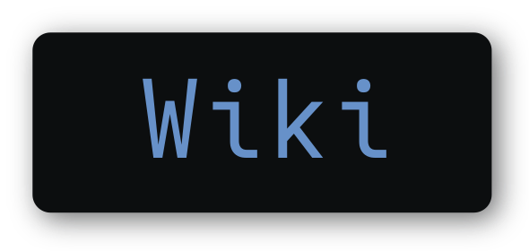
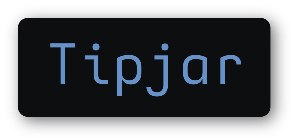

<!-- YORU BANNER -->
<div align="center">
   <a href="#--------">
      
   </a>
</div>

<p align="center">
<a href="#wrench--setup"></a>
<a href="https://github.com/rxyhn/yoru/wiki"></a>
<a href="#ocean--gallery"></a>
<a href="#money_with_wings--tip-jar"></a>
</p>

<br>

<!-- RICE PREVIEW -->
<div align="center">
   <a href="#--------">
      
   </a>
</div>

<br>

<!-- BADGES -->
<h1>
  <a href="#--------">
    
  </a>
  <a href="#--------">
    
  </a>
</h1>

<br>

## Hi there! Thanks for dropping by! :heart_on_fire:

<a href="https://awesomewm.org/"></a>

<b> Yoru (夜) Aesthetic and Beautiful Awesome Environment </b>

Welcome to my AwesomeWM configuration files!

This is my personal collection of configuration files.

You might be here looking for my AwesomeWM configuration files or looking for **Linux Rice** reference?

Feel free to steal anything from here but don't forget to give me **credits** :)

AwesomeWM is the most powerful and highly configurable next-generation framework window manager for X.
Although it takes time and effort to configure it, I am very satisfied with this aesthetic result.

<!-- INFORMATION -->

## :snowflake: ‎ <samp>Information</samp>

Here are some details about my setup:

- **OS:** [Arch Linux](https://archlinux.org)
- **WM:** [awesome](https://github.com/awesomeWM/awesome)
- **Terminal:** [wezterm](https://github.com/wez/wezterm)
- **Shell:** [zsh](https://www.zsh.org/)
- **Editor:** [neovim](https://github.com/neovim/neovim) / [vscode](https://github.com/microsoft/vscode)
- **Compositor:** [picom](https://github.com/yshui/picom)
- **Application Launcher:** [rofi](https://github.com/davatorium/rofi)
- **Music Player** [ncmpcpp](https://github.com/ncmpcpp/ncmpcpp)

AwesomeWM Modules:

- **[bling](https://github.com/blingcorp/bling)**
  - Adds new layouts, modules, and widgets that try to focus on window management primarily
- **[color](https://github.com/andOrlando/color)**
  - Clean and efficient api for color conversion in lua
- **[layout-machi](https://github.com/xinhaoyuan/layout-machi)**
  - Manual layout for Awesome with an interactive editor
- **[UPower](https://github.com/Aire-One/awesome-battery_widget)**
  - A UPowerGlib based battery widget for the Awesome WM

Main Features:

- **Eye-catching Colorscheme**
- **MacOS like window decorations**
- **Dashboard Panel**
- **Info Center Panel**
- **Notification Center Panel**
- **Bottom Panel**
- **Word Clock Lockscreen**
- **Minimalist Exit Screen**
- **Music Player**
- **App Launcher**
- **Github Activity Previews**
- **Brightness / Volume OSDs**
- **LayoutList PopUP**
- **Battery Indicator**
- **Wifi Indicator**
- **Calendar Widget**
- **Weather Widget**
- **Quick Settings Widget**
- **Hardware Monitor Widget**
- **Animated Workspace Indicator**
- **Beautiful Naughty Notification**
- **Right-Click Main Menu**

<br>

> This repo has a wiki! You can check it by clicking ~~[here](https://www.youtube.com/watch?v=UIp6_0kct_U)~~ [here](https://github.com/rxyhn/yoru/wiki).

<!-- SETUP -->

## :wrench: ‎ <samp>Setup</samp>

> This is step-by-step how to install yoru on your system. Just [R.T.F.M](https://en.wikipedia.org/wiki/RTFM).

<details>
<summary><b>1. Install Required Dependencies and Enable Services</b></summary>
<br>

:warning: ‎ **This setup instructions only provided for Arch Linux (and other Arch-based distributions)**

Assuming your _AUR Helper_ is [paru](https://github.com/Morganamilo/paru).

> First of all you should install the [git version of AwesomeWM](https://github.com/awesomeWM/awesome/).

```sh
paru -S awesome-git
```

> Install necessary dependencies

```sh
paru -Sy picom-git wezterm rofi acpi acpid acpi_call upower lxappearance-gtk3 \
jq inotify-tools polkit-gnome xdotool xclip gpick ffmpeg blueman redshift \
pipewire pipewire-alsa pipewire-pulse alsa-utils brightnessctl feh maim \
mpv mpd mpc mpdris2 python-mutagen ncmpcpp playerctl --needed
```

> Enable Services

```sh
systemctl --user enable mpd.service
systemctl --user start mpd.service
```

</details>

<details>
<summary><b>2. Install Yoru</b></summary>
<br>

> Clone this repository

```sh
git clone --depth 1 --recurse-submodules https://github.com/rxyhn/yoru.git
cd yoru && git submodule update --remote --merge
```

> Copy config files

```sh
cp -r config/* ~/.config/
```

> Install a few fonts (mainly icon fonts) in order for text and icons to be rendered properly.

Necessary fonts:

- **Roboto** - [here](https://fonts.google.com/specimen/Roboto)
- **Material Design Icons** - [here](https://github.com/google/material-design-icons)
- **Icomoon** - [here](https://www.dropbox.com/s/hrkub2yo9iapljz/icomoon.zip?dl=0)

Optional fonts:

- **My custom Iosevka build(Aesthetic Iosevka)** - [here](https://github.com/rxyhn/yoru/tree/main/misc/fonts/Aesthetic%20Iosevka)
- **Azuki Font** - [here](https://www.freejapanesefont.com/azuki-font-あずきフォント)

Once you download them and unpack them, place them into `~/.fonts` or `~/.local/share/fonts`.

Or you can find the required fonts inside the `misc/fonts` folder of this repository.

```sh
cp -r misc/fonts/* ~/.fonts/
# or to ~/.local/share/fonts
cp -r misc/fonts/* ~/.local/share/fonts/
```

And run this command for your system to detect the newly installed fonts.

```sh
fc-cache -fv
```

> Finally, now you can login with AwesomeWM

Congratulations, at this point you have installed yoru! :tada:

Log out from your current desktop session and log in into AwesomeWM

</details>

<!-- MISCELLANEOUS -->

<!-- ## :four_leaf_clover: ‎ <samp>Miscellaneous</samp>

<details>
<summary><b>VSCode Theme</b></summary>
<br>

<a href="#--------">
   
</a>

:comet: ‎ <samp>Yoru VSCode</samp>

Setup:

1. Install required extension

   - [Customize UI](https://marketplace.visualstudio.com/items?itemName=iocave.customize-ui)
   - [Carbon Product Icons](https://marketplace.visualstudio.com/items?itemName=antfu.icons-carbon)

   note: You can use any themes, but some of the colors will be overwritten by mine

2. copy config file

   ```sh
   cp misc/themes/vscode/User/settings.json ~/.config/Code/User

   ```

</details>

<details>
<summary><b>Neovim Theme</b></summary>
<br>

<a href="#--------">
   
</a>

:cyclone: ‎ <samp>Yoru Neovim</samp>

This is nvchad's port of my aesthetic theme named `yoru`

To get this theme you have to use [nvchad](https://github.com/NvChad/NvChad) as your neovim config, and then apply my theme.

</details>

<details>
<summary><b>GTK Theme</b></summary>
<br>

<a href="#--------">
   
</a>

:milky_way: ‎ <samp>Yoru gtk theme</samp>

Setup:

1. Copy the themes to the themes folders
   ```sh
   sudo cp -rf misc/themes/gtk/Yoru/* /usr/share/themes
   cp -rf misc/themes/gtk/Yoru-GTK4/* ~/.config/gtk-4.0
   ```
2. Add this line on `~/.config/gtk-3.0/settings.ini` for left controls
   ```sh
   gtk-decoration-layout=close,maximize,minimize:menu
   ```

To apply the theme use ~~[lxappearance](https://archlinux.org/packages/community/x86_64/lxappearance)~~ [lxappearance-gtk3](https://archlinux.org/packages/community/x86_64/lxappearance-gtk3)

</details>

<details>
<summary><b>Kvantum Theme</b></summary>
<br>

<a href="#--------">
   
</a>

:ringed_planet: ‎ <samp>Yoru Kvantum Theme</samp>

Setup:

1. Copy the theme to the `~/.themes/` folders

```sh
cp -rf misc/themes/kvantum ~/.themes/
```

2. To apply the theme use the Kvantum Theme Engine

3. Open **Kvantum** and click `Select a Kvantum theme folder` and locate the theme it should be on `~/.themes/kvantum/Yoru/` and select that folder

4. After that click `Install this theme`

5. Then click the `Change/Delete Theme` section there should be a combo box that says `Select a theme` pick **Yoru** then click `Use this theme`

6. Now you should have the theme enabled and installed

</details>

<details>
<summary><b>Firefox Theme</b></summary>
<br>

<a href="#--------">
   
</a>

:snowman_with_snow: ‎ <samp>Yoru Firefox</samp>

Setup:

1. Go to `about:config` in Firefox.
2. Search for `toolkit.legacyUserProfileCustomizations.stylesheets` and set it to `true`.
3. move the contents from [`misc/themes/firefox`](misc/themes/firefox) to `$HOME/.mozilla/firefox/xxxxxxxx.default-release/chrome`.

</details>

<details>
<summary><b>Discord Theme</b></summary>
<br>

<a href="#--------">
   
</a>

:speech_balloon: ‎ <samp>Yoru Discord Theme</samp>

Setup:

- Powercord

  Copy the discord folder to the powercord themes folder

  ```sh
  cp -rf misc/themes/discord /PATH/TO/DIRECTORY/WHICH/POWERCORD/IS/INSTALLED/src/Powercord/themes/
  ```

- Betterdiscord

  Copy the discord css to the betterdiscord themes folder

  ```sh
  cp misc/themes/discord/Yoru.theme.css ~/.config/BetterDiscord/themes/
  ```

> :warning: Using 3rd Party Clients are against Discord Terms and Service

</details>

<details>
<summary><b>Telegram Theme</b></summary>
<br>

<a href="#--------">
   
</a>

:telephone_receiver: <samp>Yoru Telegram Theme</samp>

Setup:

- First Method

  1. Go to: https://t.me/addtheme/yoru

  2. Open the link with your Telegram client of choice

  3. Apply the theme

- Second Method

  1. Open Telegram go to `Settings>Chat Settings>3DotMenu>Create new theme>IMPORT EXISTING THEME`

  2. Locate the theme `misc/telegram/Yoru.tdesktop-theme`

> :warning: This theme will only work on **Telegram Desktop** this won't on `MacOS, Android, and iOS`

</details> 

<details>
<summary><b>Touchpad tap-to-click & natural (reverse) scrolling (<a href="https://wiki.archlinux.org/title/Libinput#Tapping_button_re-mapping">libinput</a>)</b></summary>
<br>

`/etc/X11/xorg.conf.d/30-touchpad.conf`

```cfg
Section "InputClass"
    Identifier "touchpad"
    Driver "libinput"
    MatchIsTouchpad "on"
    Option "Tapping" "on"
    Option "TappingButtonMap" "lmr"
    Option "NaturalScrolling" "true"
EndSection
```

</details> -->

<!-- Yoru Colorscheme -->

## :art: ‎ <samp>Colorscheme</samp>

<a href="#--------"></a>

Introducing the Yoru (夜) colorscheme!

Yoru means night in english. So this beautiful and elegant color schemes are perfect for programmers who live in the middle of the night.

The nearest color combination that it can keep the eyes from getting tired! So you can keep writing code and continue all your work all night!

This colorscheme is used for all aspects in these environment, yeeaaaah this aesthetic configuration is combined with an aesthetic colorscheme <3

This colorscheme was made by me [`rxyhn`](https://github.com/rxyhn)

<!-- ToDo: Fix Color Pallete -->

<details>
<summary>Xresources</summary>
<br>

```cfg
! special
*.foreground:   #edeff0
*.background:   #0c0e0f

! black
*.color0:       #232526
*.color8:       #2c2e2f

! red
*.color1:       #df5b61
*.color9:       #e8646a

! green
*.color2:       #78b892
*.color10:      #81c19b

! yellow
*.color3:       #de8f78
*.color11:      #e79881

! blue
*.color4:       #6791c9
*.color12:      #709ad2

! magenta
*.color5:       #bc83e3
*.color13:      #c58cec

! cyan
*.color6:       #67afc1
*.color14:      #70b8ca

! white
*color7:        #e4e6e7
*color15:       #f2f4f5
```

</details>

<details>
<summary>Base46</summary>
<br>

```lua
base_30 = {
	white = "#edeff0",
	darker_black = "#060809",
	black = "#0c0e0f",
	lighter_black = "#121415",
	one_bg = "#161819",
	one_bg2 = "#1f2122",
	one_bg3 = "#27292a",
	grey = "#343637",
	grey_fg = "#3e4041",
	grey_fg2 = "#484a4b",
	light_grey = "#505253",
	red = "#DF5B61",
	baby_pink = "#EE6A70",
	pink = "#e8646a",
	line = "#1b1d1e",
	green = "#78B892",
	vibrant_green = "#81c19b",
	nord_blue = "#5A84BC",
	blue = "#6791C9",
	yellow = "#ecd28b",
	sun = "#f6dc95",
	purple = "#c58cec",
	dark_purple = "#BC83E3",
	teal = "#70b8ca",
	orange = "#E89982",
	cyan = "#67AFC1",
	statusline_bg = "#101213",
	lightbg = "#1d1f20",
	pmenu_bg = "#78B892",
	folder_bg = "#6791C9",
}

base_16 = {
	base00 = "#0c0e0f",
	base01 = "#121415",
	base02 = "#161819",
	base03 = "#1f2122",
	base04 = "#27292a",
	base05 = "#edeff0",
	base06 = "#e4e6e7",
	base07 = "#f2f4f5",
	base08 = "#f26e74",
	base09 = "#ecd28b",
	base0A = "#e79881",
	base0B = "#82c29c",
	base0C = "#6791C9",
	base0D = "#709ad2",
	base0E = "#c58cec",
	base0F = "#e8646a",
}
```

</details>

<!-- Aesthetic Iosevka Font -->

## :bookmark_tabs: ‎ <samp>Fonts</samp>

I have created a Custom Font that based on [Iosevka Custom Build](https://github.com/be5invis/Iosevka/blob/master/doc/custom-build.md), has two variants `Original` and [`Nerd Font`](https://github.com/ryanoasis/nerd-fonts). This font supports ligatures!

This is My Favorite Monospace Font! This font is used in my terminal emulator and all my code editor. Yes, for better Code.

You know what? This Font is absolutely Awesome! If combined with Yoru Colorscheme!

<b>Font Preview:</b>

- <details>
  <summary>Regular</summary>
  <br>
  <a href="#--------">
  
  </a>
  </details>

- <details>
  <summary>Italic</summary>
  <br>
  <a href="#--------">
  
  </a>
  </details>

<b>Installation:</b>

1. Clone or Download this repository
2. Change the current directory to `yoru/misc/fonts/Aesthetic Iosevka`
3. Choose the variant you want, or choose both
4. Take actions depending on your OS:
   - **Windows**: Select the font files and drag into font [settings](ms-settings:fonts) / font control panel page.
     - On Windows 10 1809 or newer, the default font installation is per-user, and it may cause compatibility issues for some applications, mostly written in Java. To cope with this, right click and select “Install for all users” instead. [Ref.](https://youtrack.jetbrains.com/issue/JRE-1166?p=IDEA-200145)
   - **macOS**: [Follow instructions here](http://support.apple.com/kb/HT2509).
   - **Linux** : Copy the font files to your fonts directory then run `sudo fc-cache`.

<b>Usage:</b>

- Original:

  ```json
  "editor.fontFamily": "Aesthetic Iosevka Original",
  "editor.fontLigatures": true,
  ```

- Nerd Font:

  ```json
  "editor.fontFamily": "AestheticIosevka Nerd Font",
  "editor.fontLigatures": true,
  ```

<!-- GALLERY -->

## :ocean: ‎ <samp>Gallery</samp>

| <b>Modern Top Panel</b>                                                                              |
| ---------------------------------------------------------------------------------------------------- |
| <a href="#--------"></a>    |

| <b>Aesthetic Dashboard</b>                                                                         |
| -------------------------------------------------------------------------------------------------- |
| <a href="#--------"></a> |

| <b>Simple & Good looking Info Center</b>                                                          |
| ------------------------------------------------------------------------------------------------- |
| <a href="#--------"></a> |

| <b>Beautiful Notification Center</b>                                                                       |
| ---------------------------------------------------------------------------------------------------------- |
| <a href="#--------"></a> |

| <b>Naughty Notifications</b>                                                                     |
| ------------------------------------------------------------------------------------------------ |
| <a href="#--------"></a> |

| <b>Custom mouse-friendly ncmpcpp UI</b>                                                         |
| ----------------------------------------------------------------------------------------------- |
| <a href="#--------"></a> |

| <b>Lockscreen with [PAM Integration](https://github.com/RMTT/lua-pam)</b>                                   |
| ----------------------------------------------------------------------------------------------------------- |
| <a href="#--------"></a> |

| <b>Minimalist Exitscreen</b>                                                                     |
| ------------------------------------------------------------------------------------------------ |
| <a href="#--------"></a> |

<!-- HISTORY -->

## :japan: ‎ <samp>History</samp>

Ngl is started when I am felt bored lol and decided to start using Linux, more precisely in January 2022. When it's in [Linuxer Desktop Art](https://facebook.com/groups/linuxart) I saw a Linux setup that caught my eye, then I'm interested in and trying something similar, So yeaaaaaah this is my current setup, I made this with all Aesthetic I have. Yes! You are right! Everything you see here is all about beautiful and aesthetic, and ofc apart from targeting the beautiful UI I also pay attention to the functionality, because I'm targeting an OS that's comfortable to wear and look at. Have a Nice Day! <3

I wanna say thank you to those of you who like and love yoru. <3

<pre align="center">
<a href="#japan--history">

</a>
</pre>

## :scroll: ‎ <samp>License</samp>

Yoru is under <a href="https://github.com/rxyhn/yoru/blob/main/LICENSE">GNU GPL-3.0 License.
</a>

<!-- Author -->

## :bust_in_silhouette: ‎ <samp>Author</samp>

Yoru is created by <a href="https://github.com/rxyhn">Rxyhn</a>.

<!-- TIP JAR -->

## :money_with_wings: ‎ <samp>TIP JAR</samp>

If you enjoyed it and would like to show your appreciation, you may want to tip me here.

It is never required but always appreciated.

Thanks from the bottom of my heart! ‎ :heartpulse:

[](https://github.com/sponsors/rxyhn)
[](https://ko-fi.com/rxyhn)

<!-- ACKNOWLEDGEMENTS -->

## :bulb: ‎ <samp>Acknowledgements</samp>

- _Contributors_

  <a href="https://github.com/rxyhn/yoru/graphs/contributors">
    
  </a>
