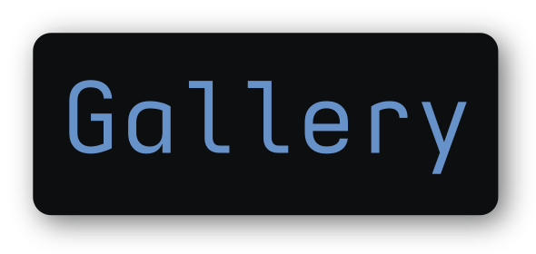
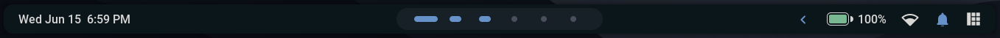
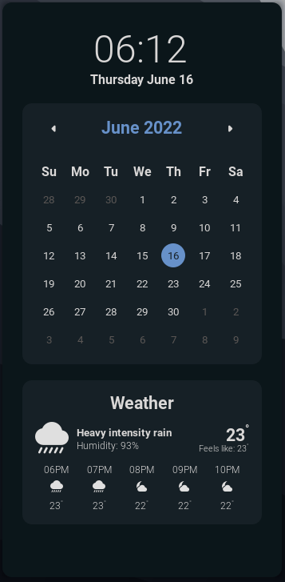

<!-- DOTFILES BANNER -->
<div align="center">
   <a href="#--------">
      
   </a>
</div>

<p align="center">
<a href="#wrench--setup"></a>
<a href="https://github.com/rxyhn/dotfiles/wiki"></a>
<a href="#ocean--gallery"></a>
<a href="#money_with_wings--tip-jar"></a>
</p>

<br>

<!-- RICE PREVIEW -->
<div align="center">
   <a href="#--------">
      
   </a>
</div>

<br>

<!-- BADGES -->
<h1>
  <a href="#--------">
    
  </a>
  <a href="#--------">
    
  </a>
</h1>

<br>

## Hi there! Thanks for dropping by! :heart_on_fire:

<a href="https://awesomewm.org/"></a>

<b> Rxyhn's Aesthetic AwesomeWM Configuration Files! </b>

Welcome to my AwesomeWM configuration files!

This is my personal collection of configuration files.

You might be here for looking my AwesomeWM configuration files? or looking for **Linux Rice** reference?

feel free to steal anything from here but don't forget to give me **credits** :)

AwesomeWM is the most powerful and highly configurable, next generation framework window manager for X,
Although it takes time and effort to configure it, but I'm very satisfied with this aesthetic result.

<!-- INFORMATION -->

## :snowflake: ‎ <samp>Information</samp>

Here are some details about my setup:

- **OS:** [Arch Linux](https://archlinux.org)
- **WM:** [awesome](https://github.com/awesomeWM/awesome)
- **Terminal:** [wezterm](https://github.com/wez/wezterm)
- **Shell:** [zsh](https://www.zsh.org/)
- **Editor:** [neovim](https://github.com/neovim/neovim) / [vscode](https://github.com/microsoft/vscode)
- **Compositor:** [picom](https://github.com/yshui/picom)
- **Application Launcher:** [rofi](https://github.com/davatorium/rofi)
- **Music Player** [ncmpcpp](https://github.com/ncmpcpp/ncmpcpp)

AwesomeWM Modules:

- **[bling](https://github.com/blingcorp/bling)**
  - Adds new layouts, modules, and widgets that try to primarily focus on window management
- **[color](https://github.com/andOrlando/color)**
  - Clean and efficient api for color conversion in lua
- **[layout-machi](https://github.com/xinhaoyuan/layout-machi)**
  - Manual layout for Awesome with an interactive editor
- **[UPower Battery Widget](https://github.com/Aire-One/awesome-battery_widget)**
  - A UPowerGlib based battery widget for the Awesome WM

Main Features:

- **Eye-catching Colorscheme**
- **MacOS like window decorations**
- **Dashboard**
- **Info Center**
- **Notification Center**
- **Bottom Panel**
- **Word Clock Lockscreen**
- **Minimalist Exit Screen**
- **Music Player**
- **App Launcher**
- **Github Activity Previews**
- **Brightness / Volume OSD**
- **LayoutList PopUP**
- **Battery Indicator**
- **Wifi Indicator**
- **Calendar**
- **Weather**
- **Animated Workspace Indicator**
- **Beautiful Naughty Notification**
- **Main Menu**

<br>

> This repo has a wiki! You can check it by clicking ~~[here](https://www.youtube.com/watch?v=UIp6_0kct_U)~~ [here](https://github.com/rxyhn/dotfiles/wiki).

<!-- SETUP -->

## :wrench: ‎ <samp>Setup</samp>

> This is step-by-step how to install these dotfiles. Just [R.T.F.M](https://en.wikipedia.org/wiki/RTFM).

<details>
<summary><b>1. Install Required Dependencies and Enable Services</b></summary>
<br>

:warning: ‎ **This setup instructions only provided for Arch Linux (and other Arch-based distributions)**

Assuming your _AUR Helper_ is [paru](https://github.com/Morganamilo/paru).

> First of all you should install the [git version of AwesomeWM](https://github.com/awesomeWM/awesome/).

```sh
paru -S awesome-git
```

> Install necessary dependencies

```sh
paru -Sy picom-git wezterm rofi acpi acpid acpi_call upower lxappearance-gtk3 \
jq inotify-tools polkit-gnome xdotool xclip gpick ffmpeg blueman redshift \
pipewire pipewire-alsa pipewire-pulse pamixer brightnessctl feh scrot \
mpv mpd mpc mpdris2 python-mutagen ncmpcpp playerctl --needed
```

> Enable Services

```sh
systemctl --user enable mpd.service
systemctl --user start mpd.service
```

</details>

<details>
<summary><b>2. Install My AwesomeWM Dotfiles</b></summary>
<br>

> Clone this repository

```sh
git clone --depth 1 --recurse-submodules https://github.com/rxyhn/dotfiles.git
cd dotfiles && git submodule update --remote --merge
```

> Copy config files

```sh
cp -r config/* ~/.config/
```

> Install a few fonts (mainly icon fonts) in order for text and icons to be rendered properly.

```sh
cp -r misc/fonts/* ~/.fonts/
# or to ~/.local/share/fonts
cp -r misc/fonts/* ~/.local/share/fonts/
```

And run this command for your system to detect the newly installed fonts.

```sh
fc-cache -v
```

> Finally, now you can login with AwesomeWM

Congratulations, at this point you have installed this aesthetic dotfiles! :tada:

Log out from your current desktop session and log in into AwesomeWM

</details>

<!-- MISCELLANEOUS -->

## :four_leaf_clover: ‎ <samp>Miscellaneous</samp>

<details>
<summary><b>GTK Theme</b></summary>
<br>

<a href="#--------">
   
</a>

:milky_way: ‎ <samp>Aesthetic-Night gtk theme</samp>

Setup:

1. Copy the themes to the themes folders
   ```sh
   sudo cp -rf misc/themes/Aesthetic-Night/* /usr/share/themes
   cp -rf misc/themes/Aesthetic-Night-GTK4/* ~/.config/gtk-4.0
   ```
2. Add this line on `~/.config/gtk-3.0/settings.ini` for left controls
   ```sh
   gtk-decoration-layout=close,maximize,minimize:menu
   ```

To apply the theme use ~~[lxappearance](https://archlinux.org/packages/community/x86_64/lxappearance)~~ [lxappearance-gtk3](https://archlinux.org/packages/community/x86_64/lxappearance-gtk3)

</details>

<details>
<summary><b>Kvantum Theme</b></summary>
<br>

<a href="#--------">
   
</a>
   
:ringed_planet: ‎ <samp>Aesthetic-Night kvantum theme</samp>

Setup:

1. Copy the theme to the ``~/.themes/`` folders
  ```sh
  cp -rf misc/themes/kvantum ~/.themes/
  ```

2. To apply the theme use the Kvantum Theme Engine

3. Open **Kvantum** and click ``Select a Kvantum theme folder`` and locate the theme it should be on ``~/.themes/kvantum/Aesthetic-Night/`` and select that folder

4. After that click ``Install this theme``

5. Then click the ``Change/Delete Theme`` section there should be a combo box that says ``Select a theme`` pick **Aesthetic-Night** then click ``Use this theme``

6. Now you should have the theme enabled and installed

</details>

<details>
<summary><b>Discord Theme</b></summary>
<br>

<a href="#--------">
   
</a>
   
:speech_balloon: ‎ <samp>Aesthetic-Night discord theme</samp>

Setup:

* Powercord
   
   Copy the discord folder to the powercord themes folder 
   
   ```sh
   cp -rf misc/discord %THE DIRECTORY WHICH POWERCORD IS INSTALLED%/powercord/src/Powercord/themes/
   ```

* Betterdiscord
   
   Copy the discord folder to the betterdiscord themes folder
   
   ```sh
   cp -rf misc/discord ~/.config/BetterDiscord/themes
   ```

</details>

<details>
<summary><b>VSCode Theme</b></summary>
<br>

<a href="#--------">
   
</a>

:comet: ‎ <samp>Aesthetic VSCode</samp>

Setup:

1. Install required extension

   - [Customize UI](https://marketplace.visualstudio.com/items?itemName=iocave.customize-ui)
   - [Carbon Product Icons](https://marketplace.visualstudio.com/items?itemName=antfu.icons-carbon)

   note: You can use any themes, but some of the colors will be overwritten by mine

2. copy config file

   ```sh
   cp misc/vscode/User/settings.json ~/.config/Code/User

   ```

</details>

<details>
<summary><b>Neovim Theme</b></summary>
<br>

<a href="#--------">
   
</a>

:cyclone: ‎ <samp>Aesthetic Neovim</samp>

This is nvchad's port of my aesthetic theme named `rxyhn`

To get this theme you have to use [nvchad](https://github.com/NvChad/NvChad) as your neovim config, and then apply my theme.

</details>

<details>
<summary><b>Firefox Theme</b></summary>
<br>

<a href="#--------">
   
</a>

:snowman_with_snow: ‎ <samp>Aesthetic Firefox</samp>

setup:

1. Go to `about:config` in Firefox.
2. Search for `toolkit.legacyUserProfileCustomizations.stylesheets` and set it to `true`.
3. move the contents from [`misc/firefox`](misc/firefox) to `$HOME/.mozilla/firefox/xxxxxxxx.default-release/chrome`.

</details>

<details>
<summary><b>Dotfiles not loaded</b></summary>
<br>

<a href="#--------">
   
</a>

> Hey rxyhn! I've already install your dotfiles by follow your setup but sadly I got nothing applied on my desktop.

well, maybe this is caused by upower battery widget didn't receive a right path, If u have a battery device then u have to change the battery ``device_path`` in [awesome/signal/battery.lua](https://github.com/rxyhn/dotfiles/blob/9b60c4905904c1a09a3f76f50e35e541200e437d/config/awesome/signal/battery.lua#L8)

> Then how to check my battery path?

```sh
# Enumerate objects paths for devices
upower -e

# Proper device_path example
/org/freedesktop/UPower/devices/battery_BAT0
```
   
> I don't have a battery device, How do I solve this problem?

You have to remove or comment battery signal init from [awesome/signal/init.lua](https://github.com/rxyhn/dotfiles/blob/9b60c4905904c1a09a3f76f50e35e541200e437d/config/awesome/signal/init.lua#L1) and the battery widget it self in [awesome/ui/panels/bottom-panel/init.lua](https://github.com/rxyhn/dotfiles/blob/1b687b439e47d8773afb1147e1b5a183c7c86308/config/awesome/ui/panels/bottom-panel/init.lua#L264)

</details>

<details>
<summary><b>Touchpad tap-to-click & natural (reverse) scrolling (<a href="https://wiki.archlinux.org/title/Libinput#Tapping_button_re-mapping">libinput</a>)</b></summary>
<br>

`/etc/X11/xorg.conf.d/30-touchpad.conf`

```cfg
Section "InputClass"
    Identifier "touchpad"
    Driver "libinput"
    MatchIsTouchpad "on"
    Option "Tapping" "on"
    Option "TappingButtonMap" "lmr"
    Option "NaturalScrolling" "true"
EndSection
```

</details>

<!-- Aesthetic Night Colorscheme -->

## :art: ‎ <samp>Colorscheme</samp>

<a href="#--------"></a>

Introducing the Aesthetic Night colorscheme!

Beautiful and elegant color scheme, perfect for programmers who live in the middle of the night.

With the neat color combination that it can keep the eyes from getting tired! so you can keep writing code and continue all your work all night!

This colorscheme is used for all aspects in these dotfiles, yeeaaaah this aesthetic dotfiles is combined with an aesthetic colorscheme <3

This colorscheme was made by [`ner0z`](https://github.com/ner0z) and modified by me [`rxyhn`](https://github.com/rxyhn)

<!-- ToDo: Fix Color Pallete -->

<details>
<summary>Palettes</summary>
<br>

<samp>special</samp>

 <table>
  <tr>
    <th><a href="#--------"></a></th>
    <th><a href="#--------"></a></th>
    <th><a href="#--------"></a></th>
    <th><a href="#--------"></a></th>
    <th><a href="#--------"></a></th>
    <th><a href="#--------"></a></th>
  </tr>
  <tr>
    <td><code>#E5E5E5</code></td>
    <td><code>#D9D7D6</code></td>
    <td><code>#000A0E</code></td>
    <td><code>#061115</code></td>
    <td><code>#0D181C</code></td>
    <td><code>#131E22</code></td>
  </tr>
</table>

<samp>normal</samp>

 <table>
  <tr>
    <th><a href="#--------"></a></th>
    <th><a href="#--------"></a></th>
    <th><a href="#--------"></a></th>
    <th><a href="#--------"></a></th>
    <th><a href="#--------"></a></th>
    <th><a href="#--------"></a></th>
    <th><a href="#--------"></a></th>
  </tr>
  <tr>
    <td><code>#1C252C</code></td>
    <td><code>#DF5B61</code></td>
    <td><code>#78B892</code></td>
    <td><code>#DE8F78</code></td>
    <td><code>#6791C9</code></td>
    <td><code>#BC83E3</code></td>
    <td><code>#67AFC1</code></td>
  </tr>
</table>

<samp>bright</samp>

 <table>
  <tr>
    <th><a href="#--------"></a></th>
    <th><a href="#--------"></a></th>
    <th><a href="#--------"></a></th>
    <th><a href="#--------"></a></th>
    <th><a href="#--------"></a></th>
    <th><a href="#--------"></a></th>
    <th><a href="#--------"></a></th>
  </tr>
  <tr>
    <td><code>#484E5B</code></td>
    <td><code>#F16269</code></td>
    <td><code>#8CD7AA</code></td>
    <td><code>#E9967E</code></td>
    <td><code>#79AAEB</code></td>
    <td><code>#C488EC</code></td>
    <td><code>#7ACFE4</code></td>
  </tr>
</table>

</details>

<details>
<summary>Xresources</summary>
<br>

```cfg
! special
*.foreground:   #d9d7d6
*.background:   #061115

! black
*.color0:       #1c252c
*.color8:       #484e5b

! red
*.color1:       #df5b61
*.color9:       #f16269

! green
*.color2:       #78b892
*.color10:      #8cd7aa

! yellow
*.color3:       #de8f78
*.color11:      #e9967e

! blue
*.color4:       #6791c9
*.color12:      #79aaeb

! magenta
*.color5:       #bc83e3
*.color13:      #c488ec

! cyan
*.color6:       #67afc1
*.color14:      #7acfe4

! white
*.color7:       #d9d7d6
*.color15:      #e5e5e5
```

</details>

<!-- GALLERY -->

## :ocean: ‎ <samp>Gallery</samp>

| <b>Modern Bottom Panel with Animation</b>                                                            |
| ---------------------------------------------------------------------------------------------------- |
| <a href="#--------"></a> |

| <b>Aesthetic Dashboard with neat grid layout</b>                                                   |
| -------------------------------------------------------------------------------------------------- |
| <a href="#--------"></a> |

| <b>Good looking Info Center</b>
| --- |
| <a href="#--------"></a> |

| <b>Beautiful Notification Center</b>                                                                       |
| ---------------------------------------------------------------------------------------------------------- |
| <a href="#--------"></a> |

| <b>Naughty Notifications</b>                                                                     |
| ------------------------------------------------------------------------------------------------ |
| <a href="#--------"></a> |

| <b>Custom mouse-friendly ncmpcpp UI</b>                                                         |
| ----------------------------------------------------------------------------------------------- |
| <a href="#--------"></a> |

| <b>Lockscreen with [PAM Integration](https://github.com/RMTT/lua-pam)</b>                                   |
| ----------------------------------------------------------------------------------------------------------- |
| <a href="#--------"></a> |

| <b>Minimalist Exitscreen</b>                                                                     |
| ------------------------------------------------------------------------------------------------ |
| <a href="#--------"></a> |

<!-- HISTORY -->

## :japan: ‎ <samp>History</samp>

Ngl this is started when im feel bored lol and decided to start using Linux, more precisely in January 2022. When it's in [Linuxer Desktop Art](https://facebook.com/groups/linuxart) i saw a linux setup that caught my eye, then I'm interested in and trying something similar, So yeaaaaaah this is my current setup, I made this with all Aesthetic I have. Yes! you're right! everything you see here is all about beautiful and aesthetic, and ofc apart from targeting the beautiful UI I also pay attention to the functionality, because I'm targeting an OS that's comfortable to wear and look at. Have a Nice Day! <3

I wanna say thank you to those of you who like and love my setup <3

<pre align="center">
<a href="#japan--history">

</a>
</pre>

<!-- TIP JAR -->

## :money_with_wings: ‎ <samp>TIP JAR</samp>

I've ko-fi account, So if you enjoyed it and would like to show your appreciation, you may want to tip me here.

It is never required but always appreciated.

Thanks from the bottom of my heart! ‎ :heartpulse:

[](https://ko-fi.com/rxyhn)

<!-- ACKNOWLEDGEMENTS -->

## :bulb: ‎ <samp>Acknowledgements</samp>

- _Contributors_

  - [`rxyhn`](https://github.com/rxyhn)
  - [`ner0z`](https://github.com/ner0z)
  - [`Kasper24`](https://github.com/Kasper24)
  - [`paulhersch`](https://github.com/paulhersch)
  - [`rototrash`](https://github.com/rototrash)
  - [`Deathemonic`](https://github.com/Deathemonic) _I make aesthetic ports_
  - [`janleigh`](https://github.com/janleigh)
  - [`ChocolateBread799`](https://github.com/ChocolateBread799)

- _Thanks to_

  - [`rxyhn`](https://github.com/rxyhn) _there's nothing wrong with thanking yourself right?_
  - [`elenapan`](https://github.com/elenapan)
  - [`manilarome`](https://github.com/manilarome)

<br>

<p align="center"><a href="https://github.com/rxyhn/AwesomeWM-Dotfiles/blob/main/.github/LICENSE"></a></p>
