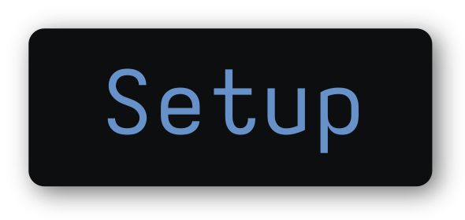
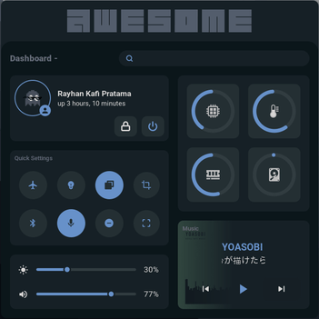
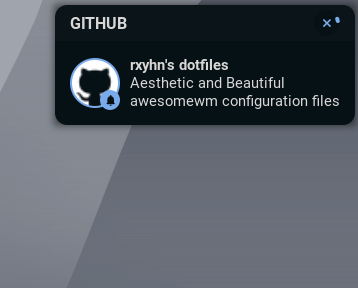
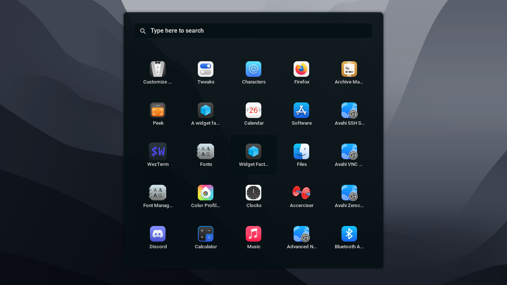

<!-- DOTFILES BANNER -->
<div align="center">
   <a href="#--------">
      
   </a>
</div>

<p align="center">
<a href="#wrench--setup"></a>
<a href="https://github.com/rxyhn/dotfiles/wiki"></a>
<a href="#ocean--gallery"></a>
<a href="#money_with_wings--tip-jar"></a>
</p>

<br>

<!-- RICE PREVIEW -->
<div align="center">
   <a href="#--------">
      
   </a>
</div>

<br>

<!-- BADGES -->
<h1>
  <a href="#--------">
    
  </a>
  <a href="#--------">
    
  </a>
</h1>

<br>

## Hi there! Thanks for dropping by! :heart_on_fire:

<a href="https://awesomewm.org/"></a>

<b> Rxyhn's Aesthetic AwesomeWM Configuration Files! </b>

Welcome to my AwesomeWM configuration files!

This is my personal collection of configuration files.

You might be here for looking my AwesomeWM configuration files? or looking for **Linux Rice** reference?

feel free to steal anything from here but don't forget to give me **credits** :)

AwesomeWM is the most powerful and highly configurable, next generation framework window manager for X,
Although it takes time and effort to configure it, but I'm very satisfied with the result.

This is a beautiful user interface isn't it?

These dotfiles are made with love, for sure.

<!-- INFORMATION -->

## :snowflake: ‎ <samp>Information</samp>

Here are some details about my setup:

- **OS:** [Arch Linux](https://archlinux.org)
- **WM:** [awesome](https://github.com/awesomeWM/awesome)
- **Terminal:** [wezterm](https://github.com/wez/wezterm)
- **Shell:** [zsh](https://www.zsh.org/)
- **Editor:** [neovim](https://github.com/neovim/neovim) / [vscode](https://github.com/microsoft/vscode)
- **Compositor:** [picom](https://github.com/yshui/picom)
- **Application Launcher:** [rofi](https://github.com/davatorium/rofi)
- **Music Player** [ncmpcpp](https://github.com/ncmpcpp/ncmpcpp)

AwesomeWM Modules:

- **[bling](https://github.com/blingcorp/bling)**
  - Adds new layouts, modules, and widgets that try to primarily focus on window management
- **[color](https://github.com/andOrlando/color)**
  - Clean and efficient api for color conversion in lua
- **[layout-machi](https://github.com/xinhaoyuan/layout-machi)**
  - Manual layout for Awesome with an interactive editor
- **[UPower Battery Widget](https://github.com/Aire-One/awesome-battery_widget)**
  - A UPowerGlib based battery widget for the Awesome WM

Main Features:

- **Eye-catching Colorscheme**
- **MacOS like window decorations**
- **Dashboard**
- **Info Center**
- **Notification Center**
- **Bottom Panel**
- **Word Clock Lockscreen**
- **Minimalist Exit Screen**
- **Music Player**
- **App Launcher**
- **Github Activity Previews**
- **Brightness / Volume OSD**
- **LayoutList PopUP**
- **Battery Indicator**
- **Wifi Indicator**
- **Calendar**
- **Weather**
- **Animated Workspace Indicator**
- **Beautiful Naughty Notification**
- **Main Menu**

<br>

> This repo has a wiki! You can check it by clicking ~~[here](https://www.youtube.com/watch?v=UIp6_0kct_U)~~ [here](https://github.com/rxyhn/dotfiles/wiki).

<!-- SETUP -->

## :wrench: ‎ <samp>Setup</samp>

> This is step-by-step how to install these dotfiles. Just [R.T.F.M](https://en.wikipedia.org/wiki/RTFM).

<details>
<summary><b>1. Install Required Dependencies and Enable Services</b></summary>

:warning: ‎ **This setup instructions only provided for Arch Linux (and other Arch-based distributions)**

Assuming your _AUR Helper_ is [paru](https://github.com/Morganamilo/paru).

> First of all you should install the [git version of AwesomeWM](https://github.com/awesomeWM/awesome/).

```sh
paru -S awesome-git
```

> Install necessary dependencies

```sh
paru -Sy picom-git wezterm rofi acpi acpid acpi_call upower lxappearance-gtk3 \
jq inotify-tools polkit-gnome xdotool xclip gpick ffmpeg blueman redshift \
pipewire pipewire-alsa pipewire-pulse pamixer brightnessctl feh scrot \
mpv mpd mpc mpdris2 python-mutagen ncmpcpp playerctl --needed
```

> Enable Services

```sh
systemctl --user enable mpd.service
systemctl --user start mpd.service
```

</details>

<details>
<summary><b>2. Install My AwesomeWM Dotfiles</b></summary>

> Clone this repository

```sh
git clone --recurse-submodules https://github.com/rxyhn/dotfiles.git
cd dotfiles && git submodule update --remote --merge
```

> Copy config files

```sh
cp -r config/* ~/.config/
```

> Install a few fonts (mainly icon fonts) in order for text and icons to be rendered properly.

```sh
cp -r misc/fonts/* ~/.fonts/
# or to ~/.local/share/fonts
cp -r misc/fonts/* ~/.local/share/fonts/
```

And run this command for your system to detect the newly installed fonts.

```sh
fc-cache -v
```

> Finally, now you can login with AwesomeWM

Congratulations, at this point you have installed this aesthetic dotfiles! :tada:

Log out from your current desktop session and log in into AwesomeWM

</details>

<!-- MISCELLANEOUS -->

## :four_leaf_clover: ‎ <samp>Miscellaneous</samp>

<details>
<summary><b>GTK Theme</b></summary>

<a href="#--------">
   
</a>

:milky_way: ‎ <samp>Aesthetic-Dark gtk theme</samp>

Setup:

```sh
cp -rf misc/themes/* ~/.themes/
# or to /usr/share/themes
sudo cp -rf misc/themes/* /usr/share/themes/
```

to apply the theme can use ~~[lxappearance](https://archlinux.org/packages/community/x86_64/lxappearance)~~ [](https://archlinux.org/packages/community/x86_64/lxappearance-gtk3)

</details>


<details>
<summary><b>Touchpad tap-to-click & natural (reverse) scrolling (<a href="https://wiki.archlinux.org/title/Libinput#Tapping_button_re-mapping">libinput</a>)</b></summary>

`/etc/X11/xorg.conf.d/30-touchpad.conf`

```cfg
Section "InputClass"
    Identifier "touchpad"
    Driver "libinput"
    MatchIsTouchpad "on"
    Option "Tapping" "on"
    Option "TappingButtonMap" "lmr"
    Option "NaturalScrolling" "true"
EndSection
```

</details>

<!-- GALLERY -->

## :ocean: ‎ <samp>Gallery</samp>

| <b>Modern Bottom Panel with Animation</b>                                                            |
| ---------------------------------------------------------------------------------------------------- |
| <a href="#--------"></a> |

| <b>Aesthetic Dashboard with neat grid layout</b>                                                   |
| -------------------------------------------------------------------------------------------------- |
| <a href="#--------"></a> |

| <b>Good looking Info Center</b>
| --- |
| <a href="#--------"></a> |

| <b>Beautiful Notification Center</b>                                                                       |
| ---------------------------------------------------------------------------------------------------------- |
| <a href="#--------"></a> |

| <b>Naughty Notifications</b>                                                                     |
| ------------------------------------------------------------------------------------------------ |
| <a href="#--------"></a> |

| <b>Custom mouse-friendly ncmpcpp UI</b>                                                         |
| ----------------------------------------------------------------------------------------------- |
| <a href="#--------"></a> |

| <b>Minimalist Application Launcher</b>                                                                        |
| ------------------------------------------------------------------------------------------------------------- |
| <a href="#--------"></a> |

| <b>Lockscreen with [PAM Integration](https://github.com/RMTT/lua-pam)</b>                                   |
| ----------------------------------------------------------------------------------------------------------- |
| <a href="#--------"></a> |

| <b>Minimalist Exitscreen</b>                                                                     |
| ------------------------------------------------------------------------------------------------ |
| <a href="#--------"></a> |

<!-- HISTORY -->

## :japan: ‎ <samp>History</samp>

Ngl this is started when im feel bored lol and decided to start using Linux, more precisely in January 2022. Fyi im a **new Linux user,** when it's in [Linuxer Desktop Art](https://facebook.com/groups/linuxart) i saw a linux setup that caught my eye, then I'm interested in and trying something similar, So yeaaaaaah this is my current setup, my purpose of doing this is to hone my skills to make an attractive UI and also as a hobby. I wanna say thank you to those of you who like and love my setup <3

<pre align="center">
<a href="#japan--history">

</a>
</pre>

<!-- TIP JAR -->

## :money_with_wings: ‎ <samp>TIP JAR</samp>

If you enjoyed it and would like to show your appreciation, you may want to tip me here.

It is never required but always appreciated.

Thanks from the bottom of my heart! ‎ :heartpulse:

[](https://ko-fi.com/rxyhn)

<!-- ACKNOWLEDGEMENTS -->

## :bulb: ‎ <samp>Acknowledgements</samp>

- _Contributors_

  - [`rxyhn`](https://github.com/rxyhn) _there's nothing wrong with thanking yourself right?_
  - [`ner0z`](https://github.com/ner0z)
  - [`Kasper24`](https://github.com/Kasper24)
  - [`paulhersch`](https://github.com/paulhersch)
  - [`rototrash`](https://github.com/rototrash)
  - [`Deathemonic`](https://github.com/Deathemonic)
  - [`janleigh`](https://github.com/janleigh)
  - [`ChocolateBread799`](https://github.com/ChocolateBread799)

- _Thanks to_

  - [`elenapan`](https://github.com/elenapan)
  - [`manilarome`](https://github.com/manilarome)

<br>

<p align="center"><a href="https://github.com/rxyhn/AwesomeWM-Dotfiles/blob/main/.github/LICENSE"></a></p>
