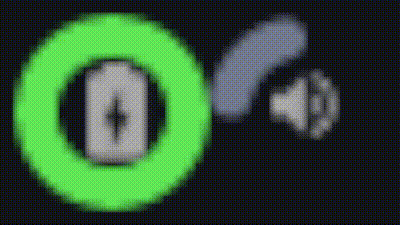

# color
Contains a bunch of useful function for conversion as well as well as a very nice api for just colors in general.

It can probably be easiest explained with a code snippet:
```lua
color = require 'color'
dark_green = color.color { r=10, g=30, b=10 }

dark_green.h, dark_green.s, dark_green.l
-- Returns 120.0 0.5 0.07843137254902

dark_green.h = 60
dark_green.r, dark_green.g, dark_green.b
-- Returns 30.0 30.0 10.0
```
As you can see, when you update one variable all the rest update with it. This is done in a relatively intelligent 
manner, however. Should you, in the example of the code snippet, update h, s or l again, it won't try to update the 
other values. Only when you access non-hsl entries will it update them. Once it's updated, you can access anything 
without it updating further until you change something again.

# What's the point though?
you can do cool stuff like this!



I do this by keeping track of two colors, one for the background and one for
the foreground. Whenever I go forwards a color, I increment the hue by 40 for
both, and whenever I go backwards I do the opposite. The two colors are exactly
40 hues away. Then, to actually change the color of the arcchart I just use the
hex parameter. The actual animation/easing is done with my
other overengineered ricing project, [rubato](https://github.com/andOrlando/rubato). 
While you can only see the colors if your volume is at like 36,000% (the grey
is 1-100%, the color changing one is 101-200%), it was a little annoying to have
it not be smooth should I ever want to blow out my speakers.

# Useful functions and more info
Furthermore, it comes with a couple nice functions too:
- `color.utils.hex_to_rgb`: takes in a string hex value (no # as of now) and returns rgb values from 0-255
- `color.utils.rgb_to_hex`: takes in a table with entries r, g and b (or just as the first three entires) and returns a string hex value (with no #)
- `color.utils.rgb_to_hsl`: takes in a table with entries r, g and b (or just as the first three entires) and returns a table with h, s and l
- `color.utils.hsl_to_rgb`: takes in a table with entries h, s and l (or just as the first three entires) and returns a table with r, g and b
- `color.transition`: takes two color objects and a method (constants defined in transition) and returns a function that transitions between the two colors. 0 would be color 1, 1 would be color 2, everything else is a color in between. For best results you probably want to use the HSL mode,

A couple more notes about the color class:
- r, g and b must be values between 0 and 255
- s and l must be between 0 and 1, whereas h must be between 0 and 360
- a must be between 0 and 1
- by setting `disable_hsl=true` on initialization, you can prevent to hex <-> rgb conversions
- by default it outputs it with a hashtag. If you don't want it to do this, set `hashtag=false` on initialization.

All the math was taken from [here](https://www.niwa.nu/2013/05/math-behind-colorspace-conversions-rgb-hsl/). 
I basically just put it into lua in a nice way. Me actaully kinda learning how to make this nice api comes
from [here](https://ebens.me/post/implementing-proper-gettersetters-in-lua). Please pardon my godawful codestyle,
I just do what I think looks pleasent, which I suppose is fitting for a ricer.

# TODO
- [ ] cool name?? (I do have color on luarocks, which is a pretty good name, but idk)
- [X] Add better # support for hex
- [ ] Add better checks (asserts and stuff)
- [X] Add alpha and toggles for whether or not to include it
- [ ] Do better setting of default methods (`obj._props.r = args.r or 0` kinda thing)
- [X] Make do good readme
- [X] Have smarter input reading (as in, don't require a table with r, g and b, look at first three indices
- [ ] Allow for 0-1 rgb
