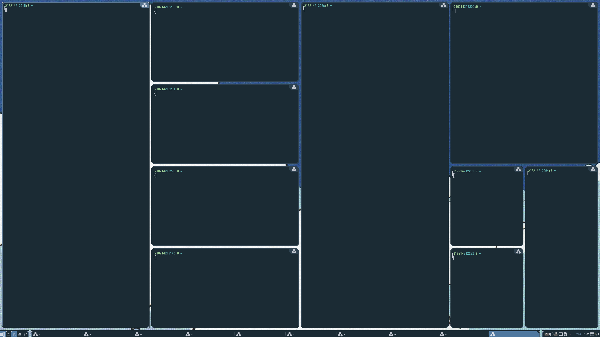

#  layout-machi

A manual layout for Awesome with a rapid interactive editor.

Demos: https://imgur.com/a/OlM60iw

Draft mode: https://imgur.com/a/BOvMeQL

__`ng` is merged into `master`. Checkout `legacy` tag for the previous master checkpoint.__

## Machi-ng

Machi-ng is a refactoring effort of machi with new features and enhancements.

### Breaking changes

1. Added a max split (before merging) of 1,000 for all commands and a global cap of 10,000 areas.
2. `t` command now applies to the current area and its further splits, instead of globally.
3. `s` command now shifts inside the last group of pending areas that have the same parent, instead of all pending areas.
4. There is no more per-layout setting of "draft mode". Every window has its own setting.

### New features & enhancements

1. Areas are protected by a minimum size (not configurable for now).
2. More tolerating "safer" error handling. If the screen cannot fit the minimum size of the layout, areas out of the screen will be hidden, but it will not crash the layout logic.
3. Dynamic size adjustment with propagation.
4. Editor can be used on areas instead of entire screens.

## Why?

TL;DR --- To bring back the control of the window layout.

1. Dynamic tiling can be an overkill, since tiling is only useful for persistent windows, and people extensively use hibernate/sleep these days.
2. Having window moving around can be annoying whenever a new window shows up.
3. I want a flexible layout such that I can quickly adjust to whatever I need.

## Compatibilities

I developed it with Awesome git version. Hopefully it works with 4.3 stable.
Please let me know if it does not work in 4.3 or older versions.

## Really quick usage

See `rc.patch` for adding layout-machi to the default 4.3 config.

## Quick usage

Suppose this git is checked out at `~/.config/awesome/layout-machi`

Use `local machi = require("layout-machi")` to load the module.

The package provide a default layout `machi.default_layout` and editor `machi.default_editor`, which can be added into the layout list.

The package comes with the icon for `layoutbox`, which can be set with the following statement (after a theme has been loaded):

`require("beautiful").layout_machi = machi.get_icon()`

By default, any machi layout will use the layout command from `machi.layout.default_cmd`, which is initialized as `w66.` (see interpretation below).
You can change it after loading the module.

## Use the layout

Use `local layout = machi.layout.create(args)` to instantiate the layout with an editor object. `args` is a table of arguments, where the followings can be used:

  - `name`: the constant name of the layout.
  - `name_func`: a `function(t)` closure that returns a string for tag `t`. `name_func` overrides `name`.
  - `icon_name`: the "system" name used by Awesome to find the icon. The default value is `machi`.
  - `persistent`: whether to keep a history of the command for the layout. The default is `true`.
  - `default_cmd`: the command to use if there is no persistent history for this layout.
  - `editor`: the editor used for the layout. The default is `machi.default_editor` (or `machi.editor.default_editor`).
  - `new_placement_cb`: a callback `function(c, instance, areas, geometry)` that fits new client `c` into the areas.
    This is a new and experimental feature. The interface is subject to changes.

If `name` and `name_func` are both nil, a default name function will be used, which depends on the tag names, screen geometries, and `icon_name`.

The function is compatible with the previous `machi.layout.create(name, editor, default_cmd)` calls.

For `new_placement_cb` the arguments are:
  - `c`: the new client to be placed.
  - `instance`: a layout and tag depedent table with the following fields available:
    - `cmd`: the current layout command.
    - `client_data`: a mapping from previously managed clients to their layout related settings and assigned areas.
      Note that it may contain some clients that are no longer in the layout. You can filter them using `screen.tiled_clients`.
      Each entry is a table with fields:
        - `.placement`: If true, the client has been placed by the layout, otherwise `new_placement_cb` will be called on the client in the further.
        - `.area`: If it is non-nil, the window is fit in the area.
        - `.lu`, `.rd`: If those are non-nil, the window is in draft mode and the fields are for the areas of its corners.
        - `.draft`: if non-nil, this is the overriding perference of draft mode for the window.
    - `tag_data`: a mapping from area ids to their fake tag data. This is for nested layouts.
  - `areas`: the current array of areas produced by `instance.cmd`. Each area is a table with the following fields available:
    - `id`: self index of the array.
    - `habitable`: if true, the area is for placing windows. It could be false for a parent area, or an area disabled by command `/`.
    - `x`, `y`, `width`, `height`: area geometry.
    - `layout`: the string used to index the nested layout, if any.
  - `geometry`: the output table the client geometry. Note that the geometry _includes_ the borders.

The callback places the new client by changing its geometry and client data.
Note that after the callback machi will validate the geometry and fit into the areas.
So no need to set the `.area`, `.lu`, or `.rd` field of the client data in the callback.
For example, to place new client in the largest area among empty areas, create the layout with
```
machi.layout.create{ new_placement_cb = machi.layout.placement.empty }
```

## The layout editor and commands

### Starting editor in lua

Call `local editor = machi.editor.create()` to create an editor.
To edit the current machi layout on screen `s`, call `editor.start_interactive(s)`.
Calling it with no arguments would be the same as `editor.start_interactive(awful.screen.focused())`.

### Basic usage

The editing command starts with the open area of the entire workarea, perform "operations" to split the current area into multiple sub-areas, then recursively edits each of them (by default, the maximum split depth is 2).
The layout is defined by a sequence of operations as a layout command.
The layout editor allows users to interactively input their commands and shows the resulting layouts on screen, with the following auxiliary functions:

1. `Up`/`Down`: restore to the history command
2. `Backspace`: undo the last command. If `Shift` is hold, restores to the current (maybe transcoded) command of the layout.
3. `Escape`: exit the editor without saving the layout.
4. `Enter`: when all areas are defined, hit enter will save the layout. If `Shift` is hold, only applies the command without saving it to the history.

### Layout command

As aforementioned, command a sequence of operations.
There are three kinds of operations:

1. Operations taking argument string and parsed as multiple numbers.

   - `h`: horizontally split. Splits to two areas evenly without args.
   - `v`: vertically split. Splits to two areas evenly without args.
   - `w`: grid split. No splits without args.
   - `d`: draft split. No splits without args.

2. Operations taking argument string as a single number or string.

   - `s`: shift open areas within the same parent. Shifts one area without args.
   - `c`: finish the open areas within the same parent. Finishes all areas with the same parent without args.
   - `t`: set the number of further split of the curret area. Sets to the default (2) splits without args.
   - `x`: set the nested layout of the current area. Behaves like `-` without args.

3. Operation not taking argument.

   - `.`: finish all areas.
   - `-`: finish the current area
   - `/`: remove the current area
   - `;`: no-op

Argument strings are composed of numbers and `,`. If the string contains `,`, it will be used to split argument into multiple numbers.
Otherwise, each digit in the string will be treated as a separated number in type 1 ops.

Each operation may take argument string either from before (such as `22w`) or after (such as `w22`).
When any ambiguity arises, operation before always take the argument after. So `h11v` is interpreted as `h11` and `v`.

For examples:

`h-v`

```
11 22
11 22
11
11 33
11 33
```


`hvv` (or `22w`)

```
11 33
11 33

22 44
22 44
```


`131h2v-12v`

Details:

 - `131h`: horizontally split the initial area (entire desktop) to the ratio of 1:3:1
 - For the first `1` part:
   - `2v`: vertically split the area to the ratio of 2:1
 - `-`: skip the editing of the middle `3` part
 - For the right `1` part:
   - `12v`: split the right part vertically to the ratio of 1:2

Tada!

```
11 3333 44
11 3333 44
11 3333
11 3333 55
   3333 55
22 3333 55
22 3333 55
```


`12210121d`

```
11 2222 3333 44
11 2222 3333 44

55 6666 7777 88
55 6666 7777 88
55 6666 7777 88
55 6666 7777 88

99 AAAA BBBB CC
99 AAAA BBBB CC
```

### Advanced grid layout

__More document coming soon. For now there is only a running example.__

Simple grid, `w44`:
```
0 1 2 3

4 5 6 7

8 9 A B

C D E F
```

Merge grid from the top-left corner, size 3x1, `w4431`:
```
0-0-0 1

2 3 4 5

6 7 8 9

A B C D
```

Another merge, size 1x3, `w443113`:
```
0-0-0 1
      |
2 3 4 1
      |
5 6 7 1

8 9 A B
```

Another merge, size 1x3, `w44311313`:
```
0-0-0 1
      |
2 3 4 1
|     |
2 5 6 1
|
2 7 8 9
```

Another merge, size 2x2, `w4431131322`:
```
0-0-0 1
      |
2 3-3 1
| | | |
2 3-3 1
|
2 4 5 6
```

Final merge, size 3x1, `w443113132231`:
```
0-0-0 1
      |
2 3-3 1
| | | |
2 3-3 1
|
2 4-4-4
```

`d` command works similarly after the inital grid is defined, such as `d1221012210221212121222`.

### Draft mode

Unlike the regular placement, where a window fits in a single area, windows in draft mode can span across multiple areas.
Each drafting window is associated with a upper-left area (UL) and a bottom-right area (BR).
The geometry of the window is from the upper-left corner of the UL to the bottom-right corner of the BR.

Draft mode is suppose to work well with grid areas (produced by `d` or `w` operations), but it is not limited to those.
Draft mode is enabled for a newly placed window if
(a) `new_placement_cb` returns so, or
(b) `new_placement_cb` is unspecified and the window's UL and BR corners fit different areas.
Resizing a window to a single area disables drafting, otherwise resizing across areas enables drafting.
You can also use `f` or `.` key in switcher UI to manually cycle through modes despit how the window previously spans areas.

### Nested layouts

__This feature is a toy. It may come with performance and usability issues - you have been warned.__

Known caveats include:

1. `arrange()` of the nested layouts are always called when the machi `arrange()` is called. This could be optimized with caching.
2. `client.*wfact` and other layout related operations don't work as machi fakes tag data to the nested layout engine.
    But it hopefully works if one changes the fields in the faked tag data.

__This feature is not available for windows in draft mode.__

To set up nested layouts, you first need to check/modify `machi.editor.nested_layouts` array, which maps an argument string (`[0-9,]+`) to a layout object.
In machi command, use the argument string with command `x` will set up the nested layout of the area to the mapped one.

For example, since by default `machi.editor.nested_layouts["0"]` is `awful.layout.suit.tile` and `machi.editor.nested_layouts["1"]` is `awful.layout.suit.spiral`,
the command `11h0x1x` will split the screen horizontally and apply the layouts accordingly - see the figure below.



### Persistent history

By default, the last 100 command sequences are stored in `.cache/awesome/history_machi`.
To change that, please refer to `editor.lua`. (XXX more documents)

## Switcher

Calling `machi.switcher.start()` will create a switcher supporting the following keys:

 - Arrow keys: move focus into other areas by the direction.
 - `Shift` + arrow keys: move the focused window to other areas by the direction. In draft mode, move the window while preserving its size.
 - `Control`[ + `Shift`] + arrow keys: move the bottom-right (or top-left window if `Shift` is pressed) area of the focused window by direction. Only works in draft mode.
 - `Tab`: switch beteen windows covering the current areas.
 - `q` or `PageUp` (`Prior`): select the parent of the current area. Hold `Control` to resize the current window accordingly.
 - `e` or `PageDown` (`Next`): select the previous child of the current area, if `q` or `PageUp` was used. Hold `Control` to resize the current window accordingly.
 - `f` or `.`: toggle the per-window setting of draft mode.
 - `/`: open the editor to edit the selected area using the same command interpretation.
   Note the final command may be transcoded to be embeddable, but the areas shall be the same.

So far, the key binding is not configurable. One has to modify the source code to change it.

## Caveats

A compositor (e.g. picom, compton, xcompmgr) is required. Otherwise switcher and editor will block the clients.

## License

Apache 2.0 --- See LICENSE
